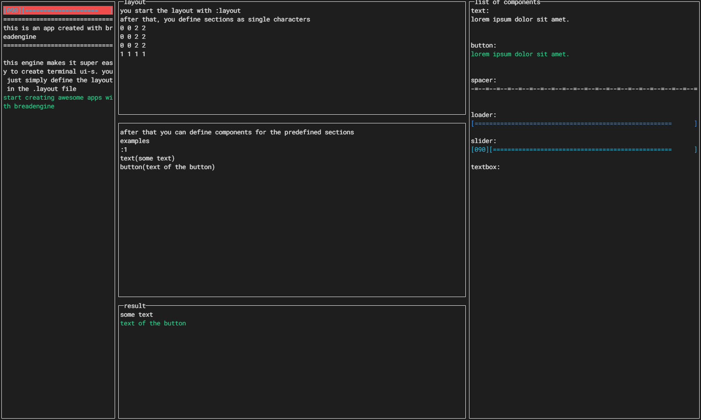

Bread engine is an engin written for the dotnet and allows you to create tui (Terminal ui)-s from a single text file. It defines the layout, you just have to listen to the events.

[Check out the source code on github](https://github.com/peterferencz/breadengine)

