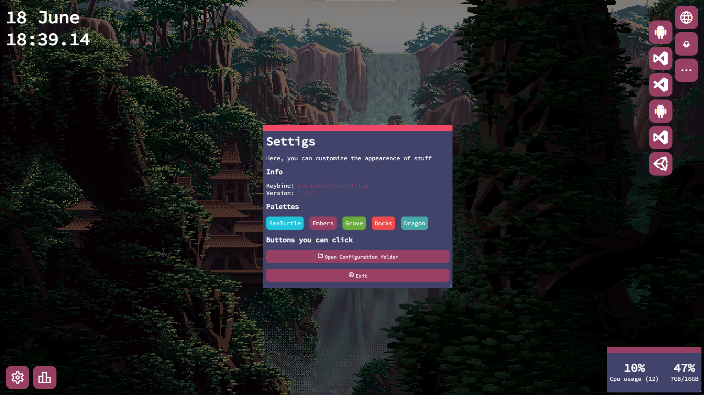

DesktopmanagR is an application written in **electron**
It runs at startup and stays in the background until a configured keypress occurs. It serves as an overlay, where you can select and launch applications quickly.

[Check out the source code on github](https://github.com/peterferencz/desktopmanager)

